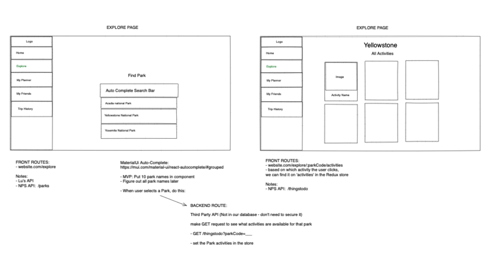

  

## Pinehopper Deployed Website

This repo is home for the codebase that powers Pinehopper, a national park trip-planner web application. Users will be able to:

- saerch and browse park activities
- view more details about each activity and bookmark it to their wishlist
- users will be able to plan and create trips with their bookmarked items

Deployed link: https://pinehopper.onrender.com/

## Project setup

1. Install NPM packages `npm install`
2. Create database `createdb PineHopper` and seed file `npm run seed`
3. Start server `npm start` and open http://localhost:8080 to view it in your browser

## Technologies used:

- [PostgreSQL](https://www.postgresql.org)
- [Sequelize](https://sequelize.org)
- [Node.js](https://nodejs.org/en/)
- [Express](https://expressjs.com)
- [JSON Web Token](https://jwt.io)
- [React](https://reactjs.org)
- [Redux](https://redux.js.org)
- [National Park Service API](https://www.nps.gov/subjects/developer/api-documentation.htm#/)
- [Render.com](https://www.render.com/)
- [Bit.io](https://bit.io/)

## Meet the Team

[Christine Zheng](https://www.linkedin.com/in/zchristine/) 
[Lu Miao](https://www.linkedin.com/in/lu-miao-6o6/) 
[Nadia Khristean Harris](https://www.linkedin.com/in/nadia-khristean-harris/)

## Pinehopper Profile Page

    

